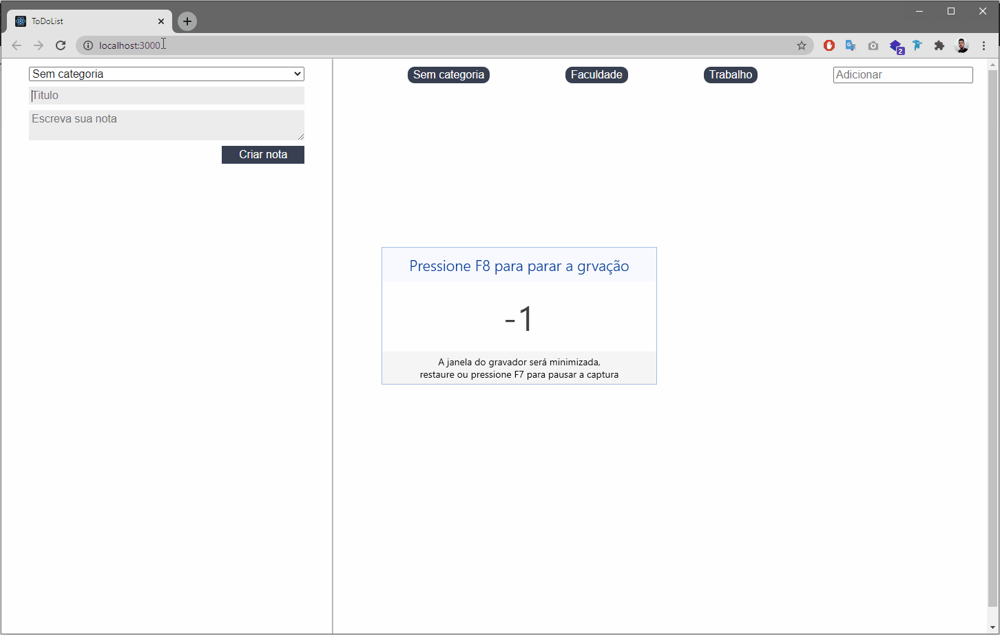

# Getting Started with ReactJS App (jsx)

Aplicação de estudos no framework ReactJS via projeto pessoal de uma lista de tarefas

<h4 align="center">
    
</h4>

This project was bootstrapped with [Create React App](https://create-react-app.dev/).

## Topicos estudados:

Orientação de estudos seguindo [documentação oficial](https://pt-br.reactjs.org/docs/getting-started.html)

* Componentes e renderização
* Propriedades
* States e ciclo de vida do componentes
* Renderização condicional (foreach)
* Elevação de states
* Forms no React
* Hooks (useState)

### `yarn start`

Runs the app in the development mode.\
Open [http://localhost:3000](http://localhost:3000) to view it in the browser.
